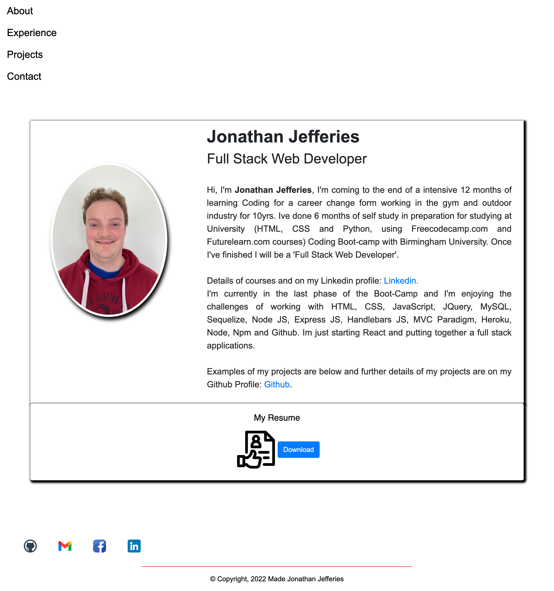

# Portfolio

## Table of Contents

- [Portfolio](#portfolio)
  - [Table of Contents](#table-of-contents)
  - [Description](#description)
    - [Technologies](#technologies)
    - [Deployed Application](#deployed-application)
  - [License](#license)
  - [Screenshots](#screenshots)

## Description

React Portfolio made in various dependencies with simple layout.

### Technologies

- CSS
- JavaScript
- Material UI
- React.js

### Deployed Application

[Deployed Link](https://jj77847.github.io/react-ideas-2/))

[Github](https://jj77847.github.io/react-ideas-2/))

## License

MIT License

## Screenshots

